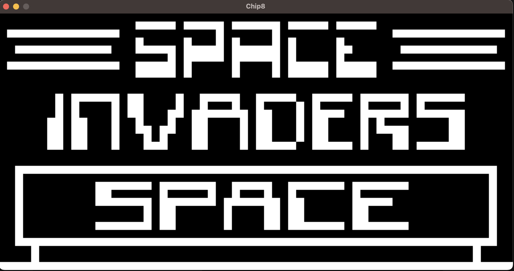

[](https://github.com/alberto-re/chip8-emu-rust/actions/workflows/ci.yml)
[](https://opensource.org/licenses/MIT)

# chip8-emu-rust

A [CHIP-8](https://en.wikipedia.org/wiki/CHIP-8) emulator written in the [Rust](https://www.rust-lang.org) programming language.



## Building

To build the emulator you need a [Rust toolchain](https://rustup.rs/) and the [SDL2](https://www.libsdl.org/) bindings available on your system.

Once installed, run the build using [Cargo](https://github.com/rust-lang/cargo):

```
$ git clone https://github.com/alberto-re/chip8-emu-rust
$ cd chip8-emu-rust
$ cargo build --release
$ ./target/release/chip8-emu-rust --version
chip8-emu-rust 1.0.0
```

## Running the emulator

Running the emulator is pretty straightforward, just specify using the --rom option the [ROM](https://en.wikipedia.org/wiki/ROM_image) to load at startup:

```sh
./target/release/chip8-emu-rust --rom roms/INVADERS
```

You can tweak the emulation speed and display scaling factor if needed. Add the --help option
to see all the options available:

```sh
./target/release/chip8-emu-rust --help
A CHIP-8 emulator

Usage: chip8-emu-rust [OPTIONS] --rom <ROM>

Options:
  -r, --rom <ROM>
      --speed <SPEED>  [default: 1000]
      --scale <SCALE>  [default: 16]
  -h, --help           Print help
  -V, --version        Print version
```
 
## Keys

The original CHIP-8 specification had a 16 key hexadecimal keypad with the following layout:

| 1 | 2  | 3 | c |
| --- |---| ---| --- |
| 4 | 5  | 6 | d |
| 7 | 8  | 9 | e |
| a | 0  | b | f |

The layout has been remapped onto a standard keyboard this way:

| 1 | 2  | 3 | 4 |
| --- |---| ---| --- |
| q | w  | e | r |
| a | s  | d | f |
| z | x  | c | v |

## References

There are plenty of information about CHIP-8 available, here are the sources that I consulted the most:

* [Cowgod's Chip-8 Technical Reference](http://devernay.free.fr/hacks/chip8/C8TECH10.HTM)   
* [CHIP-8 Wikipedia Page](https://en.wikipedia.org/wiki/CHIP-8)
* [CHIP-8 test suite](https://github.com/Timendus/chip8-test-suite)
